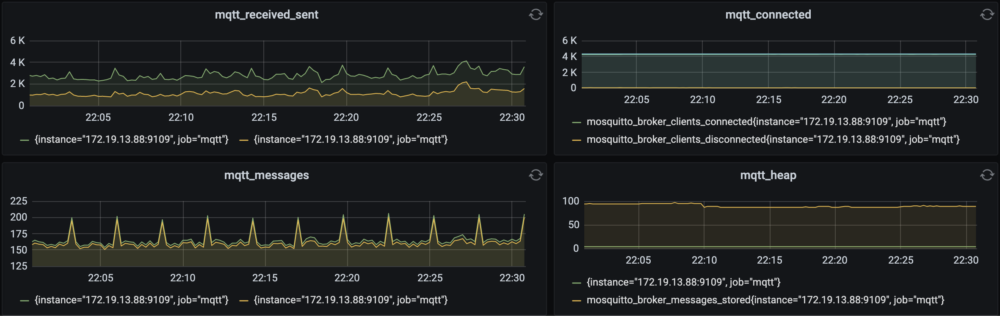

# Mosquitto Prometheus Exporter

* 
* 

Development Environment

```
docker run -v $PWD:/data -p 8080:8080 pfinal/php:7.0-apache php /data/app.php start
```


Production Environment

```
docker run -d --restart=always --name mosquitto-exporter -p 9100:9100 \
  --memory=100M --memory-swap=100M --cpus=0.5 \
  -e MQTT_ADDRESS=mqtt://www.example.com:1883 \
  -e MQTT_USERNAME=test -e MQTT_PASSWORD=test \
  -v $PWD/runtime:/data/runtime \
  pfinal/mosquitto-prometheus-exporter
```

```
http://localhost:9100
```

```
# HELP mosquitto_broker_bytes_received
# TYPE mosquitto_broker_bytes_received counter
mosquitto_broker_bytes_received 68366841
# HELP mosquitto_broker_bytes_sent
# TYPE mosquitto_broker_bytes_sent counter
mosquitto_broker_bytes_sent 27073494
# HELP mosquitto_broker_messages_received
# TYPE mosquitto_broker_messages_received counter
mosquitto_broker_messages_received 5847822
# HELP mosquitto_broker_messages_sent
# TYPE mosquitto_broker_messages_sent counter
mosquitto_broker_messages_sent 5756919
# HELP mosquitto_broker_clients_connected
# TYPE mosquitto_broker_clients_connected gauge
mosquitto_broker_clients_connected 4270
# HELP mosquitto_broker_clients_disconnected
# TYPE mosquitto_broker_clients_disconnected gauge
mosquitto_broker_clients_disconnected 43
# HELP mosquitto_broker_clients_total
# TYPE mosquitto_broker_clients_total gauge
mosquitto_broker_clients_total 4313
# HELP mosquitto_broker_heap_current
# TYPE mosquitto_broker_heap_current gauge
mosquitto_broker_heap_current 4801568
# HELP mosquitto_broker_messages_stored
# TYPE mosquitto_broker_messages_stored gauge
mosquitto_broker_messages_stored 89
```


